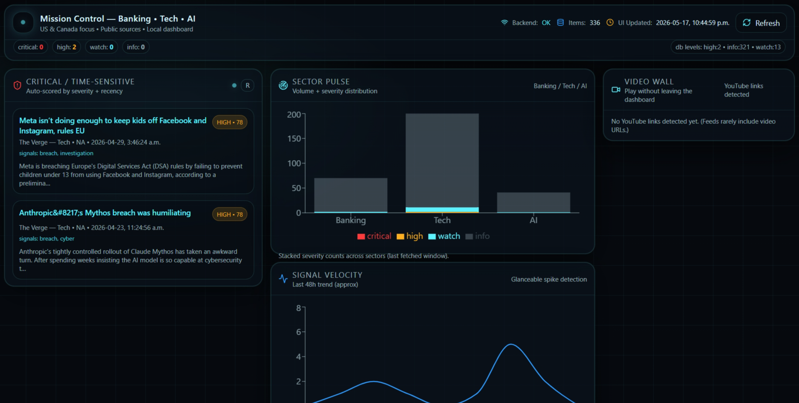
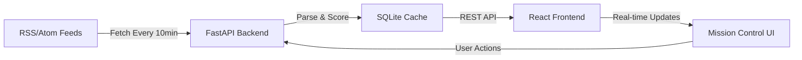

# 🎯 Mission Control — Banking • Technology • AI

<div align="center">



**🚀 Your Real-Time Intelligence Command Center**

*Monitoring Banking Regulations • Tech Innovations • AI Developments*

[](https://fastapi.tiangolo.com/)
[](https://react.dev/)
[](https://www.python.org/)
[](LICENSE)

</div>

---

## 🌟 What is Mission Control?

**Mission Control** is a sleek, cyberpunk-inspired dashboard that transforms public RSS/Atom feeds into actionable intelligence. Built for professionals who need to stay ahead of critical developments in:

- 🏦 **Banking & Financial Regulation** (Fed, FDIC, OCC, CFPB, OSFI, Bank of Canada)
- 💻 **Technology News** (The Verge, Ars Technica, Microsoft)
- 🤖 **AI Developments** (OpenAI, NVIDIA, MIT Tech Review)

### ✨ Key Features

- 🎨 **Stunning HUD Interface** — Dark, futuristic design with real-time animations
- 🔥 **Smart Scoring Engine** — Auto-prioritizes critical news using keyword analysis + recency
- 📊 **Visual Analytics** — Sector pulse charts, trend detection, signal velocity tracking
- 🎬 **Video Wall** — Embedded YouTube content when available
- ⚡ **Lightning Fast** — Local-first architecture, no cloud dependencies
- 🔒 **Privacy First** — All data stays on your machine

---

## 🖼️ Dashboard Preview


The dashboard features:
- **Critical Alerts Panel** — Time-sensitive items scored by severity
- **Sector Pulse** — Visual distribution of news across Banking, Tech, and AI
- **Signal Velocity** — Trend detection for spike identification
- **Video Wall** — Embedded media content
- **Live Status Bar** — Real-time backend health and item counts

---

## 🚀 Quick Start (Windows)

### Prerequisites
- Python 3.12+
- Node.js 18+
- PowerShell

### ⚡ One-Command Launch

```powershell
.\start.ps1
```

This script automatically:
1. ✅ Creates Python virtual environment
2. ✅ Installs all dependencies
3. ✅ Starts backend server (port 8000)
4. ✅ Launches frontend dev server (port 5173)

**Then open:** 🌐 **http://localhost:5173**

---

### 🔧 Manual Setup

#### Backend Setup
```powershell
cd backend
python -m venv venv
.\venv\Scripts\Activate.ps1
python -m pip install --upgrade pip
pip install -r requirements.txt
python -m uvicorn main:app --reload --port 8000 --reload-dir . --reload-exclude='venv' --reload-exclude='*.db'
```

#### Frontend Setup
Open a **new** PowerShell window:
```powershell
cd frontend
npm install
npm run dev
```

---

## 🎛️ How It Works



### 🧠 Intelligence Pipeline

1. **Ingestion** — Fetches from 15+ public sources every 10 minutes
2. **Scoring** — Analyzes titles/summaries for critical keywords (breach, outage, enforcement, etc.)
3. **Prioritization** — Applies recency multipliers (0-6h = 1.4x boost)
4. **Classification** — Tags as Critical (80+), High (60+), Watch (40+), or Info
5. **Visualization** — Real-time dashboard updates every 60 seconds

---

## 🎨 Tech Stack

### Frontend
- ⚛️ **React 18** with Vite for blazing-fast HMR
- 🎨 **Tailwind CSS** for utility-first styling
- 📊 **Recharts** for data visualization
- 🎬 **React Player** for video embedding
- ✨ **Framer Motion** for smooth animations

### Backend
- 🐍 **Python 3.12** with FastAPI
- 📰 **Feedparser** for RSS/Atom ingestion
- 🗄️ **SQLite** for local caching
- ⏰ **APScheduler** for background jobs
- 🔍 **Smart scoring algorithm** with keyword detection

---

## ⚙️ Configuration

### 📡 Add Custom News Sources

Edit `backend/news_sources.py`:

```python
{
    "id": "your_source",
    "name": "Your Source Name",
    "region": "US",  # US, CA, or NA
    "type": "media",  # media, regulator, company, filings
    "weight": 1.2,  # Importance multiplier (0.5-1.5)
    "url": "https://example.com/feed.xml",
}
```

### 🎯 Customize Criticality Scoring

Edit `backend/scoring.py`:

```python
CRITICAL_KEYWORDS = {
    "security": ["breach", "ransomware", "hack", "cyber"],
    "stability": ["outage", "downtime", "incident"],
    "enforcement": ["penalty", "fine", "settlement"],
    # Add your own categories!
}
```

**Scoring Formula:**
```
score = (base_score + keyword_score) × recency_multiplier × source_weight
```

---

## 🎮 Operations

| Feature | Details |
|---------|---------|
| 🔄 **Auto-Refresh** | Backend fetches every 10 minutes |
| 🖥️ **UI Polling** | Dashboard updates every 60 seconds |
| 🔘 **Manual Refresh** | Click "Refresh" button for immediate update |
| 📊 **Item Limit** | Displays last 200 items per query |
| 🎥 **Video Detection** | Auto-embeds YouTube links when found |

---

## 📁 Project Structure

```
mission_control_command_center/
├── 📂 backend/
│   ├── main.py              # FastAPI app with lifespan management
│   ├── ingest.py            # RSS/Atom fetching & parsing
│   ├── scoring.py           # Intelligence scoring engine
│   ├── storage.py           # SQLite operations
│   ├── news_sources.py      # Feed configuration
│   ├── requirements.txt     # Python dependencies
│   └── .gitignore          # Python/venv exclusions
├── 📂 frontend/
│   ├── src/
│   │   ├── App.jsx          # Main dashboard component
│   │   ├── components/      # UI components
│   │   │   ├── AlertPanel.jsx
│   │   │   ├── SectorPulse.jsx
│   │   │   ├── TrendPanel.jsx
│   │   │   ├── VideoWall.jsx
│   │   │   └── StatusBar.jsx
│   │   ├── api.js           # Backend API client
│   │   └── styles.css       # Global styles
│   ├── package.json         # Node dependencies
│   └── .gitignore          # Node/build exclusions
├── start.ps1               # One-click launcher
└── README.md               # You are here!
```

---

## 🐛 Troubleshooting

### ❌ Backend won't start?
```powershell
# Check Python version
python --version  # Should be 3.12+

# Recreate virtual environment
cd backend
Remove-Item -Recurse -Force venv
python -m venv venv
.\venv\Scripts\Activate.ps1
pip install -r requirements.txt
```

### ❌ Frontend errors?
```powershell
# Clear cache and reinstall
cd frontend
Remove-Item -Recurse -Force node_modules
Remove-Item package-lock.json
npm install
```

### ❌ Port already in use?
```powershell
# Find and kill process on port 8000
netstat -ano | findstr :8000
taskkill /PID <PID> /F
```

---

## 🎯 Roadmap

- [ ] 🌐 Multi-language support
- [ ] 📧 Email/Slack alerts for critical items
- [ ] 🔍 Advanced search and filtering
- [ ] 📱 Mobile-responsive design
- [ ] 🎨 Theme customization
- [ ] 📈 Historical trend analysis
- [ ] 🤖 AI-powered summarization
- [ ] 🔗 Integration with more data sources

---

## 🤝 Contributing

Contributions are welcome! Please feel free to submit a Pull Request.

1. Fork the repository
2. Create your feature branch (`git checkout -b feature/AmazingFeature`)
3. Commit your changes (`git commit -m 'Add some AmazingFeature'`)
4. Push to the branch (`git push origin feature/AmazingFeature`)
5. Open a Pull Request

---

## 📝 License

This project is licensed under the MIT License - see the [LICENSE](LICENSE) file for details.

---

## 🙏 Acknowledgments

- Built with ❤️ for professionals who need real-time intelligence
- Inspired by mission control interfaces from sci-fi and aerospace
- Data sources: Federal Reserve, FDIC, OCC, CFPB, OSFI, Bank of Canada, SEC, and various tech news outlets

---

<div align="center">

**⭐ Star this repo if you find it useful!**

Made with 🚀 by [Your Name]

[Report Bug](https://github.com/yourusername/mission-control/issues) • [Request Feature](https://github.com/yourusername/mission-control/issues)

</div>
